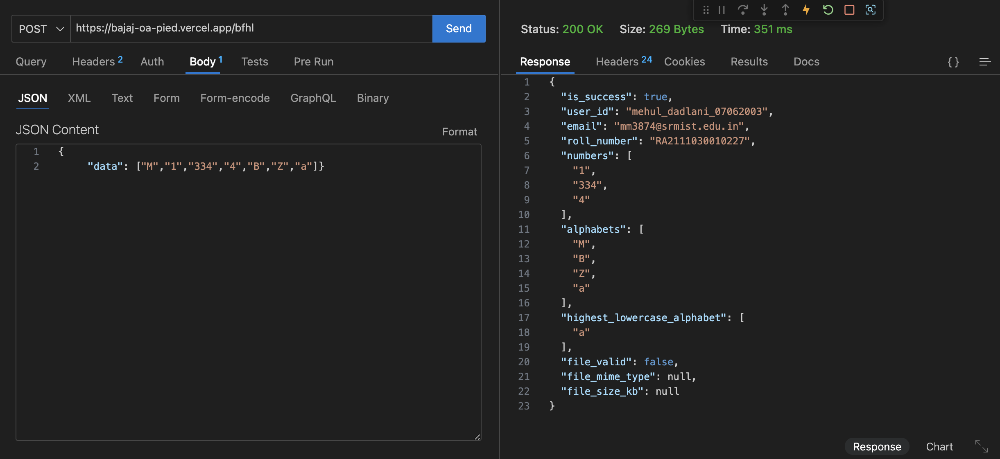
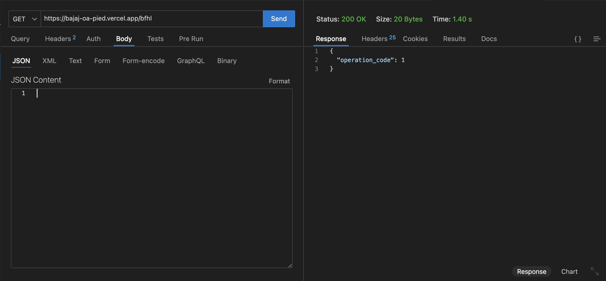
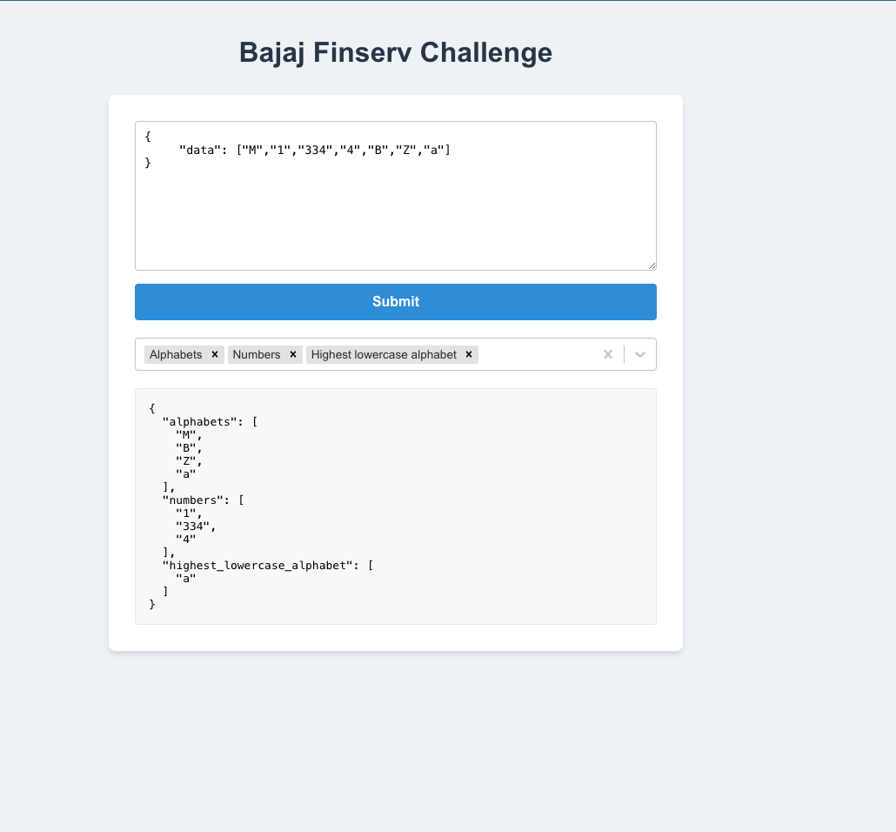
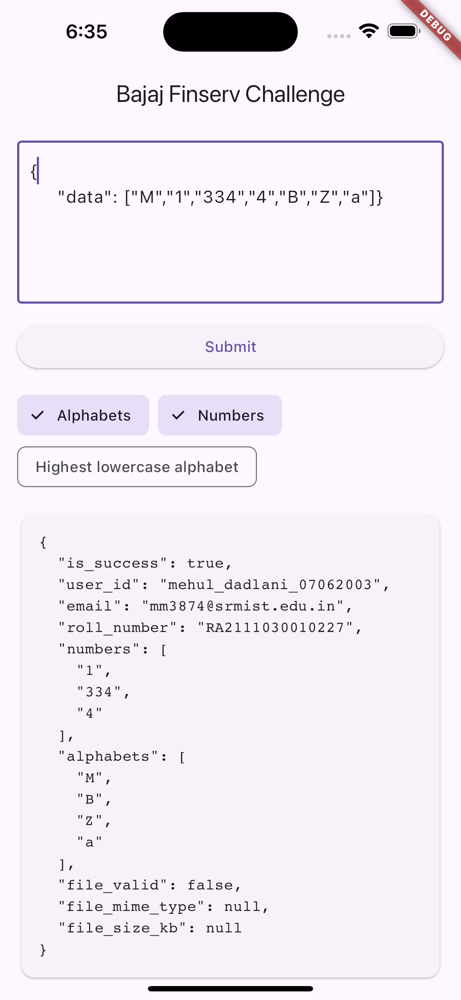

# Bajaj Finserv Health Dev Challenge

  A full-stack application developed for the Bajaj Finserv Health Dev Challenge, featuring a backend API, web frontend, and mobile app.

  <a href="#backend">Backend</a> •
  <a href="#frontend">Frontend</a> •
  <a href="#mobile-app">Mobile App</a> •
  <a href="#installation">Installation</a> •
  <a href="#technologies">Technologies</a> •

## Backend

Our RESTful API, built with Node.js and Express.js, efficiently processes input data and returns formatted responses.

### API Endpoints

- `POST /api/bfhl`: Processes input data
- `GET /api/bfhl`: Returns an operation code

View Backend Screenshot

## Frontend

A responsive web application built with React.js, allowing users to input data, interact with the backend, and view processed results.

### Key Features

- ✏️ JSON input field
- 🔽 Multi-select dropdown for result filtering
- 📊 Dynamic display of processed data

View Frontend Screenshot

## Mobile App

Our Flutter-based mobile app provides a seamless, on-the-go experience with functionality similar to the web frontend.

### Key Features

- 📱 User-friendly interface for data input
- 🖥️ Intuitive display of processed results
- 📲 Cross-platform compatibility (iOS & Android)

View Mobile App Screenshots

  

## Installation

### Backend

> cd backend npm install npm start

### Frontend

> cd frontend npm install npm start

### Mobile App

> cd mobile-app flutter pub get flutter run

## Technologies

- **Backend**: Node.js, Express.js
- **Frontend**: React.js
- **Mobile App**: Flutter
- **Deployment**: 
  - Backend: [Vercel](https://bajaj-oa-pied.vercel.app/api/bfhl)
  - Frontend: [Vercel](https://bajaj-oa-pied.vercel.app/)
  - Mobile App: [Download Link](https://drive.google.com/file/d/1t6rDfc1si52oBtBfIizjvtFsJVFG8T9U/view?usp=sharing)

## License

This project is licensed under the MIT License - see the [LICENSE.md](LICENSE.md) file for details.

---

  Made with ❤️ for Bajaj Finserv Health

